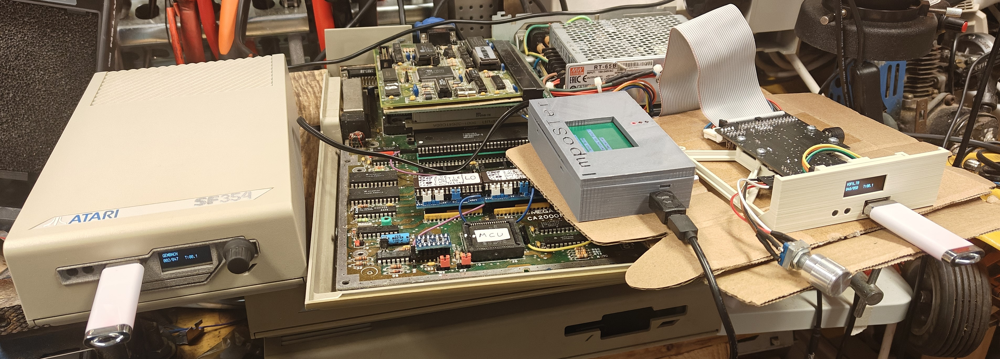

<h1 align="center">
PCB for use in an Atari SF354/314 housing.
</h1>

<h2 align="center">
Change original pcb to be able to read double sided floppy.
</h2>

---
 

---

## Background  

I bought a old SF354 case with broken (dried belt) single sided floppy drive to convert to gotek. The case was for the big eject button version. Apparently there is (at least) two differnet version of the pcb inside. One can be used with double sided drives without modifications. And one with a lot of components on the pcb that needs modifications to work with double sided drives (the one I got above). I didn't get any signal cable or power cable/brick with my SF354 so it was no meaning to modify the old pcb since I hade to source a power cable for it. So I did a new PCB instead and used USB-C to power it. 

---

## What you will need  

- 1 Adapter PCB. Order with the [gerber] file "SF354_adapter_pcb_gerber_v1.5.zip" from your favorite PCB manufactory. 
- 1 or 2 BERG 4 pin floppy power connector (or solder the wires dierectly to the pcb).
- 1 or 2 100nF (0,1uF) 0805 SMD capacitors. This can bew omitted if you want.
- 1 or 2 1uF capacitors. Either SMD (1206) or through hole (5,12mm leg pitch).
- 1 47uF electrolytic capacitor. Either SMD (size C. 6,3x7,7mm) or through hole (5mm leg pitch).
- 2 14 pin DIN connectors. Desolder from old pcb (only 1 is needed).
- 1 34 pin IDC connector. (or solder the wires dierectly to the pcb).
- 1 USB-C 6 pin SMD connector.
- 1 switch (SPDT) or small piece of wire if you don't use it. 
- 1 Gotek or disk drive. If Gotek is used you must remove motor on jumper. Only DS0 should be jumpered.
- 1 3D printed [bracket] for Gotek pcb. 

BOM/partlist can also be found in the [gerber] zip. There is also PDFs for some parts.

---

## How to

Start by desoldering the 2 DIN connectors for the singals. 

| Solder 1 PCB with chips and capacitors. Take note of the orientation on pin 1 on PCB and chip (pin 1 is marked with circle on PCB. Notch on the left side of chip and text is readable (not upside-down) then pin 1 is located on bottom left side. (I hadn't a photo of PCB without pins soldered in - So disregard that)|    |
| :--- | :---: |
| Cut pinheaders and place on motherboard. I did lower right side then a few here and there to get it straight. Do ***_NOT_*** solder in. Place PCB on top of unsoldered pins. Solder the RAM PCB first when it's resting on the motherboard pins. Lift RAM PCB and put in a few more of the single pins. Put RAM PCB back and solder those. Keep doing until you have all the pins soldered on the RAM PCB. Then put the RAM PCB back on motherboard. Trim the lenght of pins and solder the pins underneath the motherboard. |     |
| Looks good. A few steps left now. |     |
| Solder the three resistors if they are missing (68ohm thru hole) on R71, R72 and R73 for the CAS1H, CAS1L and RAS1 signals on the motherboard. |  |
| A9 (or MAD9) needs to be connected from RAM PCB to MMU with a wire. MAD9 is located on [PLCC MMU on pin 64](images/A9%20connected%20on%20PLCC%20pin%2064.jpg) and SMD MMU on pin 66. If the PLCC chip is in socket it is easier to solder to pin 64 underneath the motherboard. |   |

---

## Useful info

You do not need a hot air station/gun. Chip can be desolder by bending a thick copper wire around all legs and then adding a lot of solder. By dragging the soldering iron across the wire and all the legs on each side, the chip will eventually come loose. It will be messy. Desolder the exess with braid. The SMD RAM chips is soldered on RAM PCB with drag soldering and a knife edge on the soldering iron. If you are more comfortable using other methods, use that! Flux is your friend. Use alot of flux!

---

## Testing

I tested this with a Mega ST 1 upgraded to 4Mb and with a TSENG ET4000AX graphics card. I also used 256Kb roms (EmuTOS v1.3 and TOS v2.06). I used two Goteks in the picture below but I also tested with two real floppy disk drives. But it should work with any double sided drive and system I hope.

 

---

PCB made by Daniel Guldkrans aka DoG in Eagle April 2025.

[gerber]: gerbers/SF354_adapter_pcb_gerber_v1.5.zip
[bracket]: https://www.thingiverse.com/thing:6960806

